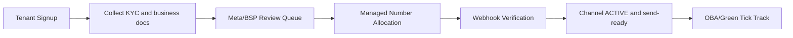

# Meta / BSP Operations Runbook

## Objective

Provide a repeatable operational process for managed WhatsApp onboarding:
tenant signup -> document review -> number assignment -> webhook verification -> active send state.

## Process flow

## RACI

- **Ops Manager:** Owns daily queue and escalation timeline.
- **Compliance Reviewer:** Validates KYC and business legality documents.
- **Number Desk:** Procures and allocates managed numbers.
- **Platform Engineer:** Verifies webhook events and delivery health.
- **Customer Success:** Updates tenant status and communicates blockers.

## Daily checklist

- Review new onboarding requests and assign operator owner.
- Validate tenant legal name, website, and contact details.
- Confirm WABA and number inventory availability before assignment.
- Complete webhook verification and confirm inbound test event.
- Update OBA eligibility state for each tenant with active channel.

## Escalation matrix

- **P1 (send blocked for active tenant):** Engineering + Ops within 15 minutes.
- **P2 (number assignment delay > 1 business day):** Ops manager escalation.
- **P3 (doc mismatch):** Compliance reviewer follow-up same day.

## Required artifacts

- Tenant onboarding request form export.
- Business verification status log.
- Number assignment audit log.
- Webhook verification evidence (requestId + event sample).
