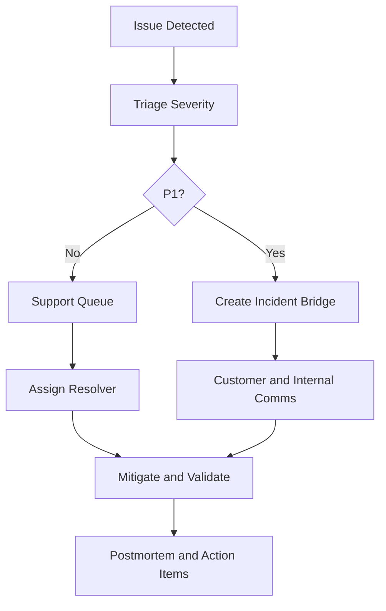

# Support and Incident Playbook

## Objective

Define support tiers, SLAs, and incident response workflow for pilot launch.

## SLA targets

- **P1 Critical (outbound blocked, auth outage, tenant isolation risk):** first response 15 minutes, mitigation 1 hour.
- **P2 High (partial webhook failures, delayed sync, onboarding stuck):** first response 2 hours, mitigation same business day.
- **P3 Medium (UI regression, reporting discrepancy):** first response 1 business day, mitigation 3 business days.

## Incident workflow

## Roles

- **Incident Commander:** Owns timeline and coordination for P1.
- **Technical Resolver:** Executes remediation and verification.
- **Comms Owner:** Sends customer updates and ETA changes.
- **Scribe:** Captures timeline, actions, and postmortem inputs.

## Response templates

- Initial acknowledgment template with severity and ETA.
- Hourly update template for unresolved P1 incidents.
- Resolution summary template with impact and preventive actions.

## Postmortem minimums

- Impact window and affected tenant scope.
- Root cause and contributing factors.
- Detection gap analysis.
- Preventive action items with owner + due date.
